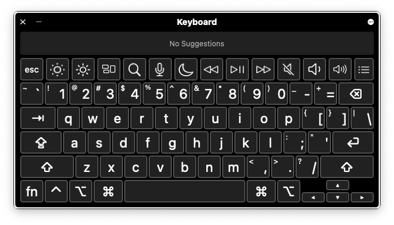
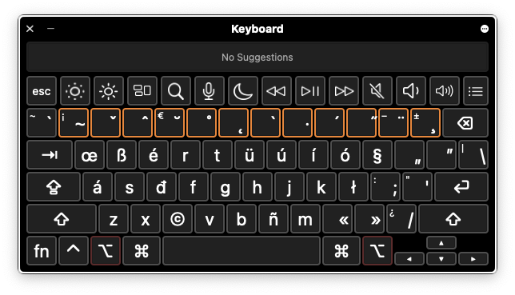
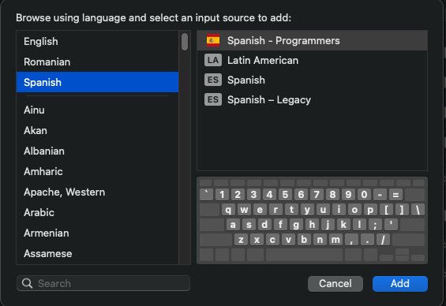

# Acerca de
Diseño de teclado «Español - Programadores» para Mac OS X / macOS inspirado en https://github.com/SaltwaterC/romanian-programmers-mac
Implementado usando [Ukelele](https://scripts.sil.org/ukelele)

Resumiendo:
- ALT + n -> ñ
- ALT + e -> é
- ALT + a -> á
- ALT + i -> í
- ALT + o -> ó
- ALT + u -> ú

Normal:

Modificador Alt:

# Instalación
Clon Git -> ejecuta `install.sh` -> añade el nuevo layout en Preferencias del Sistema -> Teclado -> Fuentes de Entrada, o copia manualmente el `Spanish - Programmers.bundle` a `/Library/Keyboard Layouts/`, reinicia y añádelo en Preferencias del Sistema -> Teclado -> Fuentes de Entrada.

# About
Keyboard layout "Spanish - Programmers" for Mac OS X / macOS inspired by https://github.com/SaltwaterC/romanian-programmers-mac
Implemented using [Ukelele](https://scripts.sil.org/ukelele)

In short:
- ALT + n -> ñ
- ALT + e -> é
- ALT + a -> á
- ALT + i -> í
- ALT + o -> ó
- ALT + u -> ú

Normal:

Alt modifier:

# Installation
Git clone -> run `install.sh` -> add the new layout in System Preferences -> Keyboard -> Input Sources, or manually copy the `Spanish - Programmers.bundle` to `/Library/Keyboard Layouts/`, restart and add it in System Preferences -> Keyboard -> Input Sources.
